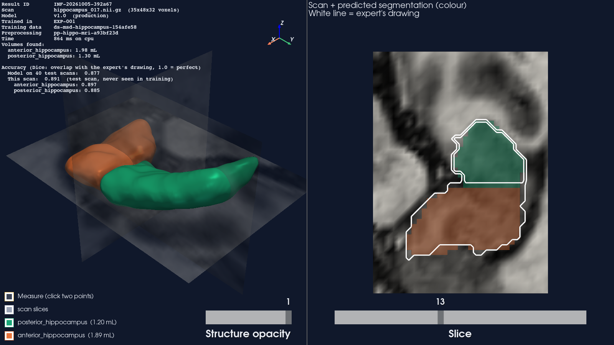
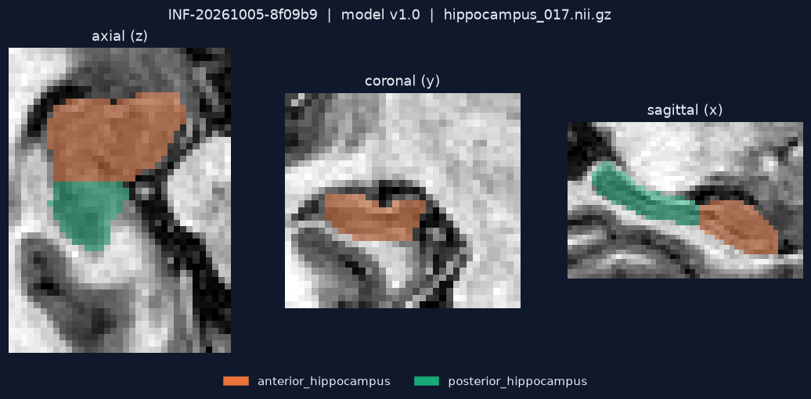

# 3D Medical Imaging ML Pipeline

This project takes an MRI scan, segments structures in it with a PyTorch 3D U-Net,
and turns the result into 3D models you can rotate, measure and export.

The model is only one part of it. I wanted the whole path from raw scan to 3D model
to be reproducible and traceable. For any prediction you can ask "which scan, which
model, which training data, which code?" and get a verified answer.

**Disclaimer:** this is a technical demo. It is not intended for diagnosis, treatment,
clinical decisions or patient care, and it is not a medical device.



## How it works

```
 MRI / CT scan
      |
      v
 check the scan  ->  list it in a versioned dataset (manifest)
      |
      v
 preprocess (same steps every time, version = hash of the settings)
      |
      v
 train a 3D U-Net (PyTorch)  ->  experiment record
      |
      v
 evaluate on held-out scans  ->  register the model  ->  promote to production
      |
      v
 new scan  ->  segmentation  ->  3D meshes  ->  viewer
                    |
                    +->  inference record  ->  lineage trace back to the source scan
```

Every step writes a small JSON record into `artifacts/`. Records point to each other
by ID and by file hash, so you can follow any output back to where it came from.

## Results

Trained on my laptop CPU (no GPU), 20 epochs, about 55 minutes.
The model has 350,827 parameters.

| | Scans | Mean Dice | Anterior | Posterior |
|---|---|---|---|---|
| Validation | 26 | 0.876 | 0.884 | 0.869 |
| Test (never seen in training) | 40 | 0.877 | 0.883 | 0.872 |

- Test IoU: 0.783
- Inference: about 0.1 s for the network and 0.5 s end to end per scan, on CPU
- For comparison, nnU-Net (the strong standard baseline) reports about 0.89-0.90 on
  this task. Its test set is different, so the numbers are not directly comparable.

Training is reproducible. I restarted an interrupted run and the first epoch gave
exactly the same loss (1.8197) and validation Dice (0.3964).



## Setup

You need Python 3.10 or newer. A GPU is optional.

Windows (PowerShell):

```powershell
py -3.12 -m venv .venv
.\.venv\Scripts\Activate.ps1
pip install torch --index-url https://download.pytorch.org/whl/cpu
pip install -e ".[dev]"
```

Linux / macOS: `make setup`

Docker (runs the tests): `docker build -t medimg3d .` then `docker run --rm medimg3d`

## Run everything

On Windows, one script runs the whole pipeline (training takes about 55 min):

```powershell
.\scripts\run_pipeline.ps1
```

On Linux / macOS, use the Makefile targets in the same order:
`make data train-demo register evaluate promote infer mesh viewer trace`

Below are the individual steps, so you can run and inspect each one.

## Step by step

### 1. Get the data

I use the hippocampus task from the
[Medical Segmentation Decathlon](http://medicaldecathlon.com): 260 brain MRI scans
with labels for two structures, the anterior and posterior hippocampus. It is only
27 MB, so the whole project runs on a normal laptop. Licence: CC-BY-SA 4.0.

```powershell
python -m src.data.download --out data
python -m src.data.manifest --config configs/data.yaml
```

The download checks the file against a fixed SHA-256 before unpacking.

The manifest step checks every scan (size, spacing, broken values, label matches
image) and writes a list of all accepted scans. Each scan gets an ID made from its
content hash, not from its file name, because in hospitals file names often contain
patient names. The dataset version is a hash of all scans and the split, so if any
scan changes, the version changes.

Split: 194 train, 26 validation, 40 test.

### 2. Train

```powershell
python -m src.training.train --config configs/train.yaml
```

All settings come from `configs/train.yaml`. If you mistype a key, it fails
immediately instead of quietly using a default.

The result goes to `artifacts/experiments/EXP-001/`. That folder holds
`experiment.json`, which records the git commit, seed, all configs and the hash of
the best checkpoint, alongside the loss and Dice for every epoch.

### 3. Register and evaluate

```powershell
python -m src.registry.model_registry register --experiment EXP-001 --version v1.0
python -m src.evaluation.evaluate --model-version v1.0 --split test
```

Evaluation runs the same code the inference command uses, on the 40 test scans, and
compares the result to the real labels in the original scan size. It reports Dice,
IoU, precision and recall per structure, plus timing.

### 4. Promote

```powershell
python -m src.registry.model_registry promote --version v1.0 --to validated --reason "test results meet the release rules"
python -m src.registry.model_registry promote --version v1.0 --to production --reason "approved for demo"
python -m src.registry.model_registry list
```

A model goes `candidate -> validated -> production`. To become `validated` it needs a
test evaluation that passes the rules in `configs/release.yaml` (at least 20 test
scans and Dice of at least 0.80). You can't skip a step, and every change needs a
reason. The registry stores who changed what, and when.

### 5. Segment a scan

```powershell
python -m src.inference.predict --input data/Task04_Hippocampus/imagesTr/hippocampus_017.nii.gz --model-version production
```

This prints an inference ID like `INF-20261005-abc123`. The command:

- checks the scan
- uses the preprocessing that was saved with the model (you can't pass a different one)
- verifies the model file hash before loading it
- saves the segmentation in the same size and position as the input scan
- writes a record with the input hash, model version and output hash

You can also pass a folder of DICOM files as `--input`.

### 6. Build the 3D models and open the viewer

```powershell
python -m src.reconstruction.mesh --inference-id INF-...
python -m src.visualization.viewer --case INF-...
```

The mesh step creates one 3D surface per structure (marching cubes) and saves it as
STL, PLY and OBJ. Coordinates are in millimetres in scanner space, so the meshes line
up with the scan in other tools too.

In the viewer you can:

- rotate (left mouse), zoom (wheel) and pan (shift + left mouse)
- turn each structure and the scan slices on or off
- change the opacity of the structures
- measure distances: tick "Measure", then click two points
- scroll through slices with the segmentation on top (right panel)

For a static image of three slices, run `python -m src.visualization.slices --case INF-...`.

### 7. Trace a prediction

```powershell
python -m src.lineage.trace --inference-id INF-...
```

This walks back from the prediction to the model, the evaluation, the experiment, the
dataset, the preprocessing settings and the original scan. It doesn't only look things
up: it re-computes the hashes of the files involved. If anything was changed
afterwards, it reports FAIL. It also warns you if the scan you ran was part of the
training data.

## Trying other scans

- **Fair test:** use one of the 40 test scans. The trace shows `split: test`.
  Their numbers: 017 025 044 053 058 089 093 107 109 114 141 158 162 166 172 174 175
  180 184 188 189 199 203 215 217 225 226 230 231 235 280 314 322 327 345 354 355 359
  378 394 (files `imagesTr/hippocampus_NNN.nii.gz`).
- **New scans:** `data/Task04_Hippocampus/imagesTs/` has 130 scans without labels.
  The trace says the scan is not part of the dataset.
- **Training scan:** any other file in `imagesTr/`. The trace warns that the result is
  not a fair test.

## Tests

```powershell
python -m pytest -q
```

61 tests, about one minute on CPU. Among other things they check:

- loading NIfTI and DICOM, and rejecting broken scans
- that preprocessing gives the same result every time, and can be undone exactly
- the model, checkpoints, and that a changed checkpoint file is refused
- that training twice gives identical weights
- metrics, including edge cases like empty masks
- registry rules (no skipping steps, versions can't be overwritten)
- that the meshes are closed and have the right volume
- that the trace detects an edited prediction or dataset file
- a full run of the pipeline on small synthetic scans

GitHub Actions runs linting (ruff), type checks (mypy) and the tests on every push.
CI uses the synthetic scans, so it doesn't need the real dataset or long training.

## Project layout

```
configs/          all settings (data, preprocessing, training, release rules, meshes)
src/
  data/           loading, checks, manifest, download, synthetic test data
  preprocessing/  image preprocessing and how to undo it
  models/         the 3D U-Net and checkpoint saving/loading
  training/       training loop, augmentation, loss
  evaluation/     metrics and the test evaluation
  registry/       model versions and promotion
  inference/      segmenting a new scan
  reconstruction/ segmentation to 3D meshes
  visualization/  3D viewer and slice images
  lineage/        records and the trace command
tests/
scripts/          run_pipeline.ps1 for Windows
docs/             architecture and notes on regulated software
artifacts/        everything the pipeline produces (not in git)
```

More detail: [docs/architecture.md](docs/architecture.md) explains the design choices.
[docs/regulated_ml_notes.md](docs/regulated_ml_notes.md) covers what this means for
medical device software.

## Limitations

- One small public dataset from one hospital. I haven't tested other scanners or patient groups.
- The scans are small crops around the hippocampus. Whole-body CT would need patch-based
  training.
- The registry is a JSON file for one user. There is no login and no tamper-proof storage.
- No uncertainty estimate per prediction, and no check for unusual input data.
- The viewer is a demo, not a clinical viewer.

## Licence

Code: MIT. Dataset: Medical Segmentation Decathlon Task04, CC-BY-SA 4.0 (not included
in this repo).
